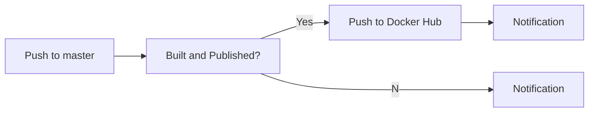

# [LTA DataMall API](https://lta-datamall-api.azurewebsites.net)
An ASP.NET Web API for querying transport-related datasets from [Singapore LTA DataMall](https://datamall.lta.gov.sg/content/datamall/en/dynamic-data.html).


---
Join my [Discord Server](https://discord.gg/GkhjfYth) and   [Telegram Channel](https://t.me/s/ltadatamallapi) 

[](https://discord.gg/GkhjfYth)


---

<details>
<summary>Get Started</summary>

## 1. Account Key
   An account key is required for calling the APIs and you can request it from [LTA DATAMALL](https://datamall.lta.gov.sg/content/datamall/en/request-for-api.html).


## 2. Forking or Cloning Code
   ```shell
   git clone "https://github.com/tsbsia/LTA-DataMall-API.git"
   ```

## 3. Setting Up Account Key
#### Change to project directory
   ```shell
   cd .\LTA-DataMall-API\src\
   ```
   
#### Enable secret storage
   ```shell
   dotnet user-secrets init
   ```
#### Set account key secret 
   ```shell   
   dotnet user-secrets set "LtaDataService:AccountKey" "[YOUR-ACCOUNT-KEY]"
   ```
## 4. Build and Run

#### Restore 
   ```shell
   dotnet restore
   ```
#### Build
   ```shell
   dotnet build
   ```
#### Run 
   ```shell
   dotnet run --launch-profile "Web API"
   ```
#### Browse 

Open URL [https://localhost:7153/index.html](https://localhost:7153/index.html) in a web browser.

</details>

---


<details>

<summary>Project Workflows</summary>

## GitHub Actions for publishing the image to Docker Hub

The project workflows can automate **build** and **publish** the <code style="color : blue">lta-datamall-api</code> Docker image to [Docker Hub](https://hub.docker.com/repositories/tsbsia) using [GitHub Actions](https://help.github.com/en/articles/about-github-actions).


### Prerequisites

-   Discord Server setting up. 

-   Telegram Channel setting up.

</details>

## Play-With-Docker
Here's a quick start using Play-With-Docker (PWD) to start-up a service.

[](https://labs.play-with-docker.com/?stack=https://raw.githubusercontent.com/tsbsia/LTA-DataMall-API/master/pwd-docker-compose.yml)
