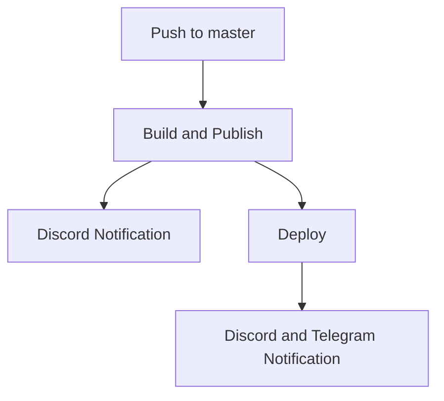

# [LTA DataMall API](https://lta-datamall-api.azurewebsites.net)
An ASP.NET Web API for querying transport-related datasets from [Singapore LTA DataMall](https://datamall.lta.gov.sg/content/datamall/en/dynamic-data.html).


---
Join my [Discord Server](https://discord.gg/GkhjfYth) and   [Telegram Channel](https://t.me/s/ltadatamallapi) 

[](https://discord.gg/GkhjfYth)


---

<details>
<summary>Get Started</summary>

## 1. Account Key
   An account key is required for calling the APIs and you can request it from [LTA DATAMALL](https://datamall.lta.gov.sg/content/datamall/en/request-for-api.html).


## 2. Forking or Cloning Code
   ```shell
   git clone "https://github.com/tsbsia/LTA-DataMall-API.git"
   ```

## 3. Setting Up Account Key
#### Change to project directory
   ```shell
   cd .\LTA-DataMall-API\src\
   ```
   
#### Enable secret storage
   ```shell
   dotnet user-secrets init
   ```
#### Set account key secret 
   ```shell   
   dotnet user-secrets set "LtaDataService:AccountKey" "[YOUR-ACCOUNT-KEY]"
   ```
## 4. Build and Run

#### Restore 
   ```shell
   dotnet restore
   ```
#### Build
   ```shell
   dotnet build
   ```
#### Run 
   ```shell
   dotnet run --launch-profile "Web API"
   ```
#### Browse 

Open URL [https://localhost:7153/index.html](https://localhost:7153/index.html) in web browser.

</details>

---


<details>

<summary>Project Workflows</summary>

## GitHub Actions for deploying to Azure Web App for Containers

The project workflows can automate **build** and **publish** the <code style="color : blue">lta-datamall-api</code> Docker image to [Azure Container  Registry](https://azure.microsoft.com/en-us/products/container-registry), and **deploy** it to [Azure Web Apps for Containers](https://azure.microsoft.com/en-us/products/app-service/containers/) using [GitHub Actions](https://help.github.com/en/articles/about-github-actions).


### Prerequisites

-  Azure Web App and Registry provisioning. See [Deploy a custom container to App Service using GitHub Actions](https://learn.microsoft.com/en-us/azure/app-service/deploy-container-github-action?tabs=publish-profile) for more information.

-   Discord Server setting up. 

-   Telegram Channel setting up.


### Workflow file
---

```yaml
name: Build and deploy a container to an Azure Web App

env:
  AZURE_WEBAPP_NAME: lta-datamall-api  # set this to the name of your Azure Web App
  DOCKER_IMAGE_NAME: lta-datamall-api
  
on:
  push:
    paths-ignore:
      - 'README.md'
    branches: [ "master" ]
jobs:
  build:
    runs-on: ubuntu-latest
    steps:
    - name: 'Checkout'
      uses: actions/checkout@v3
      
    - name: 'Login Azure Container Registry'
      uses: azure/docker-login@v1
      with:
        login-server: tsbsia.azurecr.io
        username: ${{ secrets.AZURE_REGISTRY_USERNAME }}
        password: ${{ secrets.AZURE_REGISTRY_PASSWORD }}
        
    - name: 'Build Docker image'
      run: docker build ./src --tag tsbsia.azurecr.io/${{ env.DOCKER_IMAGE_NAME }}:${{ github.sha }}
      
    - name: 'Publish to Azure Container Registry'
      run: docker push tsbsia.azurecr.io/${{ env.DOCKER_IMAGE_NAME }}:${{ github.sha }} 
    - name: Discord notification
      env:
        DISCORD_WEBHOOK: ${{ secrets.DISCORD_WEBHOOK }}
      uses: Ilshidur/action-discord@master
  deploy:
    runs-on: ubuntu-latest
    needs: build
    environment:
      name: 'Development'
      url: ${{ steps.deploy-to-webapp.outputs.webapp-url }}

    steps:
    - name: Deploy to Azure Web App
      id: deploy-to-webapp
      uses: azure/webapps-deploy@v2
      with:
        app-name: ${{ env.AZURE_WEBAPP_NAME }}
        publish-profile: ${{ secrets.AZURE_WEBAPP_PUBLISH_PROFILE }}
        images: 'tsbsia.azurecr.io/${{ env.DOCKER_IMAGE_NAME }}:${{ github.sha }}'

    - name: Discord and Telegram notification
      uses: hunghg255/action-notifications@master
      with:
        discord_webhook: ${{ secrets.DISCORD_WEBHOOK }}
        telegram_bot_token: ${{ secrets.TELEGRAM_BOT_TOKEN }}
        telegram_chat_id: ${{ secrets.TELEGRAM_CHAT_ID }}
        title: "Deploy to Azure Web App"
        description: "New version of ${{ env.DOCKER_IMAGE_NAME }}:${{ github.sha}} has been deployed to https://lta-datamall-api.azurewebsites.net"

```
</details>
